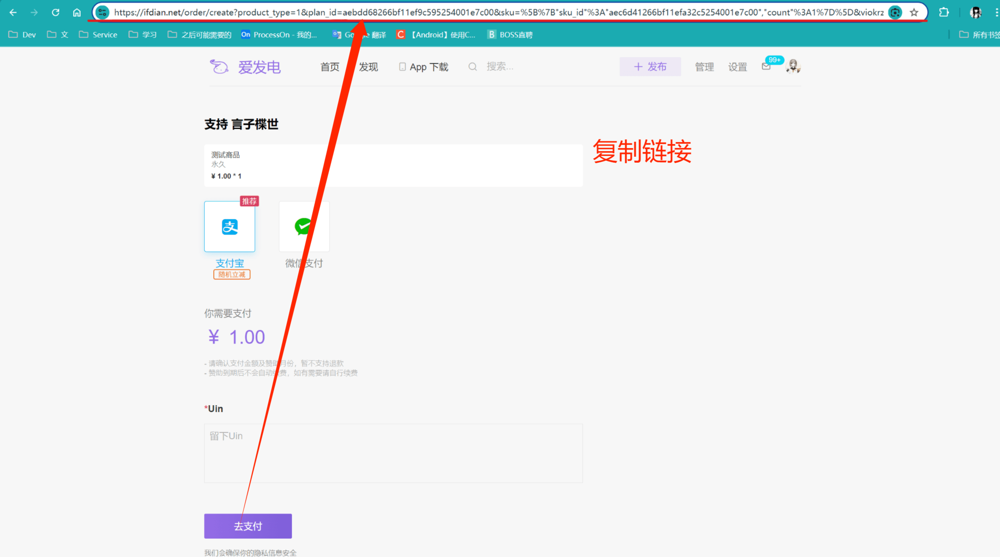
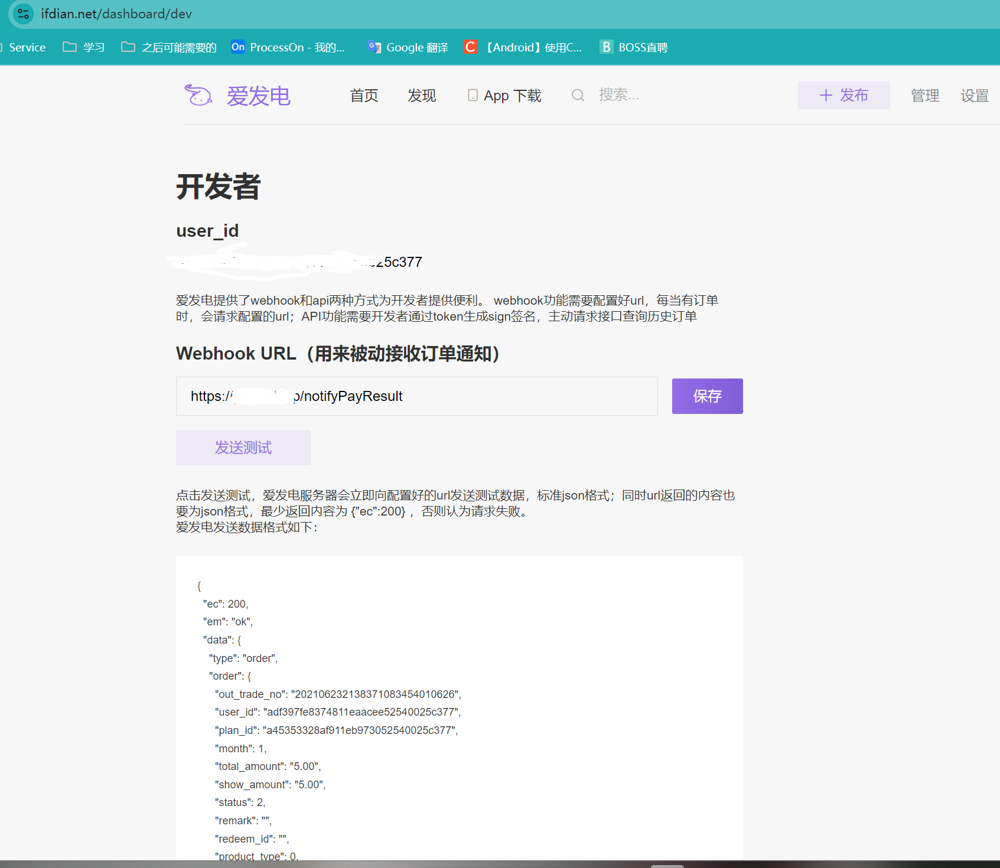

# 爱发电 支付SDK工具 for Java 
## 高效对接爱发电支付 方便个人开发者支付赞助
### 仅作封装，仅供学习交流使用，请遵守官方规则。

### 目前实现的功能
- [x] 生成赞助链接，并自定义一些参数
- [x] 解析赞助请求体为对象
- [x] 查询订单列表
- [ ] 查询赞助者列表

---
### 使用 先拉取依赖
maven
```xml
<dependency>
    <groupId>top.sacz.maven</groupId>
    <artifactId>afdian-pay</artifactId>
    <version>1.0.1</version>
</dependency>
```
gradle
```groovy
    implementation 'top.sacz.maven:afdian-pay:1.0.1'
```
---
### 1. 生成赞助链接,这个操作简单的封装了爱发电的支付链接 
首先 获取赞助url，这个是爱发电的赞助支付页链接，可以从下图位置复制到自己的赞助链接，接下来会用到


使用 `AfdianUtil.newPayUrlBuilder(url)` 方法构造即可，返回值为 `AfdianPayUrlBuilder` 对象，可以设置自定义参数，最后通过 `build()` 方法生成最终的支付链接。
```java
    @GetMapping("/createOrder")
    public String createOrder(String userName) {
        //可根据用户名生成订单号,实现订单,我这里不做具体逻辑
        //url 为爱发电 赞助支付页的链接
        String url = "https://ifdian.net/order/create?product_type=1&plan_id=2219e4d4660911efb2ee52540025c377&sku=%5B%7B%22sku_id%22%3A%22222481dc660911efa8ae52540025c377%22%2C%22count%22%3A1%7D%5D&viokrz_ex=0";
        //构造自定义参数的支付链接
        String payUrl = AfdianUtil.newPayUrlBuilder(url)
                .setRemark("自定义备注参数")//自定义备注
                .setCustomOrderId("suzhelan12345" + System.currentTimeMillis())//自定义订单号
                .build();
        System.out.println("支付链接为："+payUrl);
        return payUrl;
    }
```


### 2. 解析赞助请求体为对象
原本的通知回调请求体是一个json字符串，为了方便，sdk封装了解析为对象，方便使用  

`AfdianPayOrder.Order order = AfdianUtil.parseOrder(body);` 

Order对象与爱发电中订单参数完全对应

```java
    @RequestMapping("/notifyPayResult")
    public Object onPayResult(@RequestBody String body) {
        AfdianPayOrder.Order order = AfdianUtil.parseOrder(body);
        return AfdianUtil.returnSuccess();
    }
```

配置爱发电的赞助回调地址 先上线到服务端才能保存和测试 需要是https才能保存哦


### 3. 查询订单列表
订单列表查询需要提供开发者的的 **user_id** 和 **token** 可以在 [爱发电开发者后台](https://ifdian.net/dashboard/dev) 获取  
然后调用 `AfdianUtil.newOrderSearcher(String userId, String token)` 方法获取到OrderSearcher实例对象  
使用OrderSearcher 即可进行订单查询 按照分页查询
```java

public static List<AfdianPayOrder.Order> queryOrderByPage(int page) {

    OrderSearcher orderSearcher = AfdianUtil.newOrderSearcher("31e505d6a30b11eea4bf52540025c377", "DyVmKFnPHBfab7vxw3dUMTgsRqu95CEp");
    //查询第一页
    OrderPage orderPage = orderSearcher.queryOrder(page);
    //总页数
    int totalPage = orderPage.getTotalPage();
    //总订单数
    int totalCount = orderPage.getTotalCount();
    System.out.println("总页数:" + totalPage);
    System.out.println("总订单数:" + totalCount);
    //订单列表
    List<AfdianPayOrder.Order> list = orderPage.getList();
    for (AfdianPayOrder.Order order : list) {
        System.out.println("订单号:" + order.getOutTradeNo());
    }
    return list;
}
```


### 其他参数和对象说明请参阅官方文档 
```text
total_count     赞助者总数
total_page      页数，默认每页50条，请求时，传 page ，curr_page < total_page则可继续请求

out_trade_no 订单号
custom_order_id 自定义信息
user_id 下单用户ID
plan_id 方案ID，如自选，则为空
title 订单描述
month 赞助月份
total_amount 真实付款金额，如有兑换码，则为0.00
show_amount 显示金额，如有折扣则为折扣前金额
status 2 为交易成功。目前仅会推送此类型
remark 订单留言
redeem_id 兑换码ID
product_type 0表示常规方案 1表示售卖方案
discount 折扣
sku_detail 如果为售卖类型，以数组形式表示具体型号
address_person 收件人
address_phone 收件人电话
address_address 收件人地址
```

